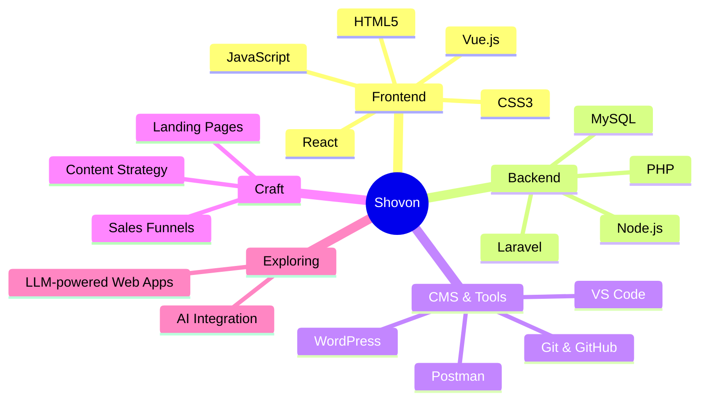
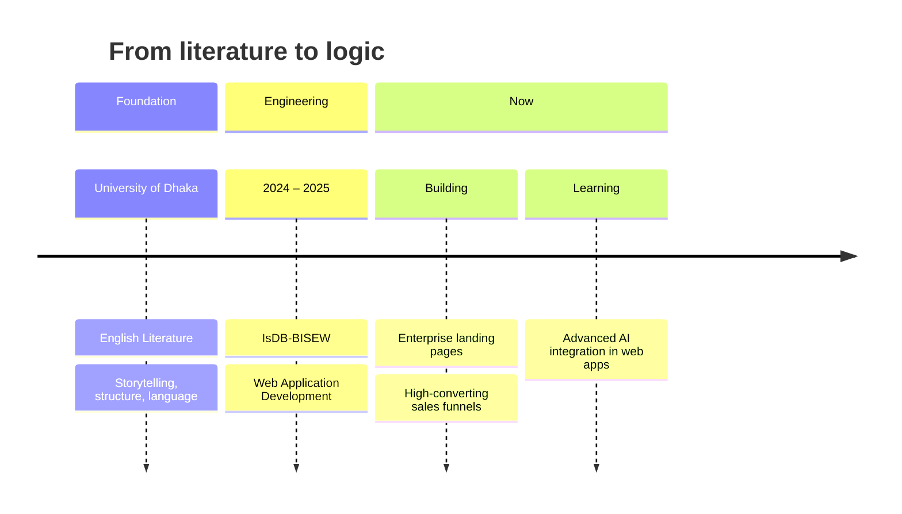
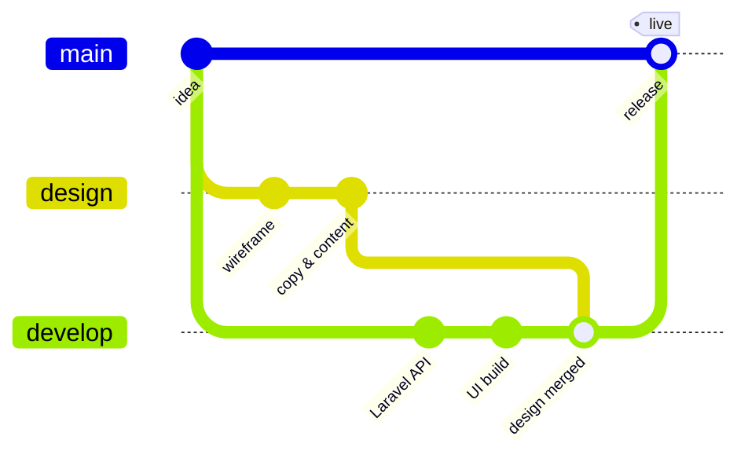

<div align="center">

<a href="https://git.io/typing-svg">
  
</a>

<p>
  <a href="mailto:jishovon@gmail.com"></a>
  <a href="https://wa.me/8801733956590"></a>
  <a href="https://www.linkedin.com/in/jishovon/"></a>
  <a href="https://www.facebook.com/shovon.5271"></a>
  <a href="https://www.instagram.com/zero2_jis"></a>
  <a href="#"></a>
</p>

</div>

---

## `~/shovon $ php artisan about:me`

```text
  ╭──────────────────────────────────────────────────────╮
  │  JOHIRUL ISLAM SHOVON                    v2025.stable │
  ╰──────────────────────────────────────────────────────╯

  Environment ............................ production
  Role ................ Web Application Developer
  Also ............. Digital Content Manager
  Background ........ English Literature · University of Dhaka
  Training ............. IsDB-BISEW Web App Development (2024–25)
  Currently building ... Enterprise Landing Pages & Sales Funnels
  Currently learning ... Advanced AI Integration in Web Apps
  Side effects ......... Debugs code and writes poetry simultaneously
  Status ............... ● open to collaborations
```

---

## 🧬 Developer, expressed as code

```php
<?php

namespace Shovon;

final class Developer implements Creative, Logical
{
    public function __construct(
        public readonly string $name       = 'Johirul Islam Shovon',
        public readonly array  $roots      = ['English Literature', 'University of Dhaka'],
        public readonly array  $crafts     = ['Web Applications', 'Sales Funnels', 'Digital Content'],
        public readonly array  $stack      = ['Laravel', 'PHP', 'MySQL', 'React', 'Vue', 'Node.js', 'WordPress'],
        public string          $learning   = 'Advanced AI Integration in Web Apps',
        public string          $motto      = 'Code is like humor. When you have to explain it, it’s bad.',
    ) {}

    public function build(string $idea): DigitalExperience
    {
        return $this->design($idea)      // the poet
                    ->engineer()         // the developer
                    ->ship();            // the operator
    }

    public function collaborate(): bool
    {
        return true; // always
    }
}
```

---

## 🧠 Mind map



---

## 🛤️ Journey



---

## 🔀 How I ship



---

## 🛠️ Technical arsenal

<details open>
<summary><b>Frontend</b></summary>
<br>


</details>

<details open>
<summary><b>Backend & Database</b></summary>
<br>


</details>

<details open>
<summary><b>Tools & CMS</b></summary>
<br>


</details>

---

## 📊 GitHub analytics

<div align="center">

<!-- Theme-aware: dark theme for dark mode, default for light mode -->
<picture>
  <source media="(prefers-color-scheme: dark)" srcset="https://github-readme-stats.vercel.app/api?username=ShovonScripts&show_icons=true&theme=tokyonight&include_all_commits=true&count_private=true&hide_border=true">
  <source media="(prefers-color-scheme: light)" srcset="https://github-readme-stats.vercel.app/api?username=ShovonScripts&show_icons=true&theme=default&include_all_commits=true&count_private=true&hide_border=true">
  
</picture>
<picture>
  <source media="(prefers-color-scheme: dark)" srcset="https://github-readme-stats.vercel.app/api/top-langs?username=ShovonScripts&layout=compact&langs_count=8&theme=tokyonight&count_private=true&hide_border=true">
  <source media="(prefers-color-scheme: light)" srcset="https://github-readme-stats.vercel.app/api/top-langs?username=ShovonScripts&layout=compact&langs_count=8&theme=default&count_private=true&hide_border=true">
  
</picture>

<br>


<br>


</div>

---

## 📬 Handshake

```http
POST /collaborate HTTP/1.1
Host: github.com/ShovonScripts
Content-Type: application/json
Accept: opportunities

{
  "email":    "jishovon@gmail.com",
  "whatsapp": "+8801733956590",
  "linkedin": "in/jishovon",
  "message":  "Let's build something amazing together."
}
```

<div align="center">
  <br>
  <sub><code>return new DigitalExperience();</code> &nbsp;·&nbsp; <i>Let's build something amazing together.</i></sub>
</div>
